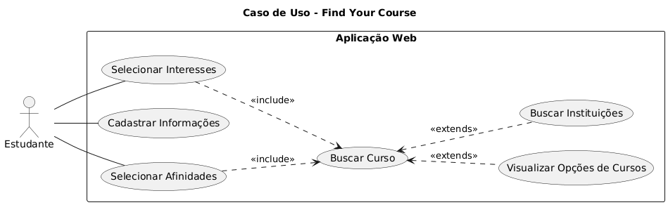

# CASO DE USO

<!--@startuml
title Caso de Uso - Find Your Course

left to right direction

actor Estudante 

rectangle "Aplicação Web" {

  usecase "Realizar Survey" as UC1
  usecase "Editar Preferências" as UC2
  usecase "Buscar Curso" as UC3
  usecase "Visualizar Opções de Cursos" as UC5
  usecase "Buscar Instituições" as UC6
  usecase "Buscar Tutoriais de CV" as UC7
  usecase "Visualizar informações do Curso" as UC8
  usecase "Visualizar Vestibulares" as UC9

}

Estudante -- UC1
Estudante -- UC7
Estudante -- UC9

UC1 ..> UC3 : <<include>>

UC3 <.. UC6 : <<extends>>
UC3 <.. UC5 : <<extends>>
UC5 <.. UC8 : <<extends>>
UC1 <.. UC2 : <<extends>>

@enduml-->

# Modelo de Negocio

