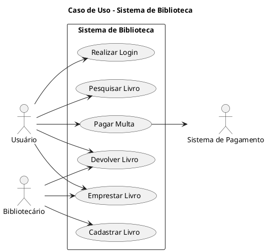

```plantuml
@startuml
title Caso de Uso - Sistema de Biblioteca

left to right direction

actor Usuário
actor Bibliotecário
actor "Sistema de Pagamento" as Pagamento

rectangle "Sistema de Biblioteca" {

  usecase "Realizar Login" as UC1
  usecase "Pesquisar Livro" as UC2
  usecase "Emprestar Livro" as UC3
  usecase "Devolver Livro" as UC4
  usecase "Pagar Multa" as UC5
  usecase "Cadastrar Livro" as UC6

}

Usuário --> UC1
Usuário --> UC2
Usuário --> UC3
Usuário --> UC4
Usuário --> UC5

Bibliotecário --> UC6
Bibliotecário --> UC3
Bibliotecário --> UC4

UC5 --> Pagamento

@enduml
```
